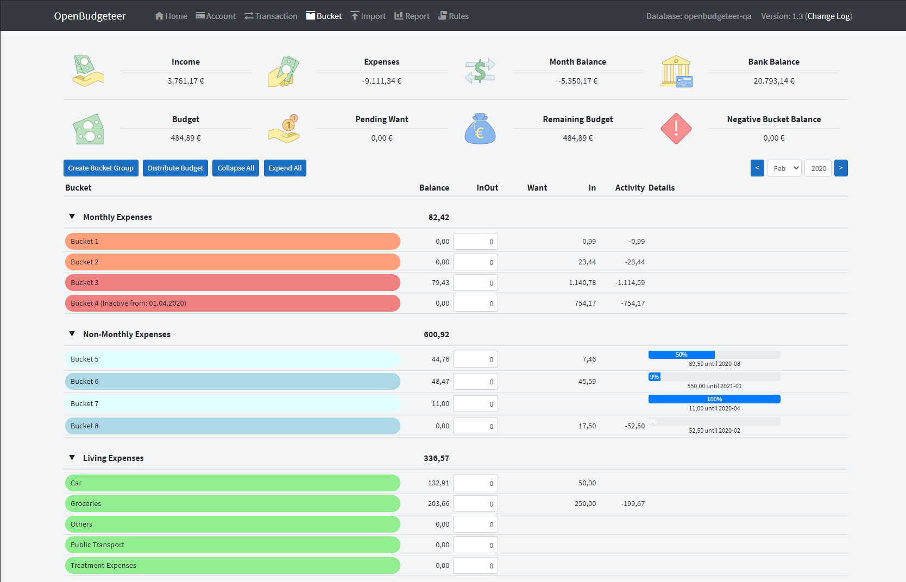
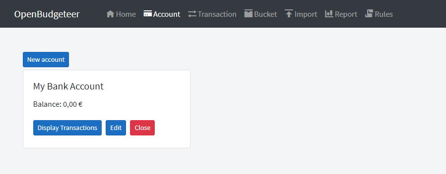
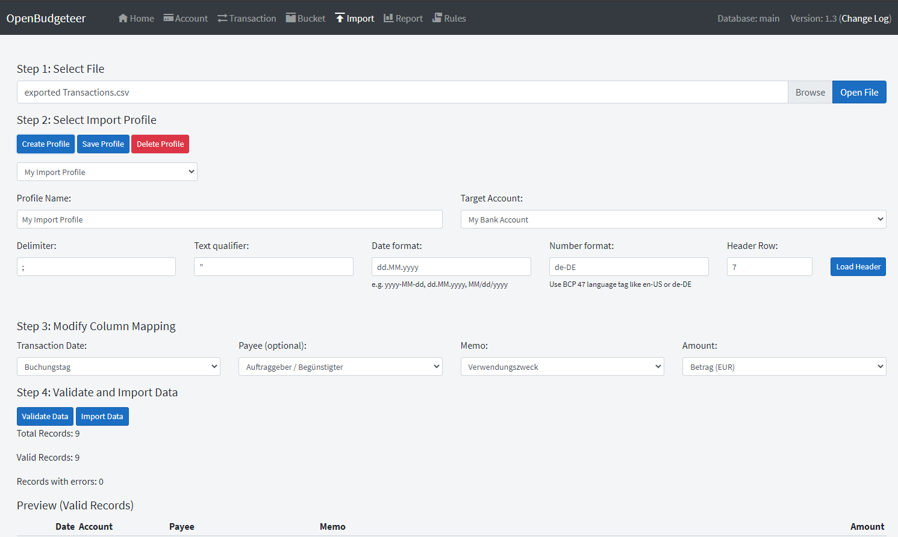
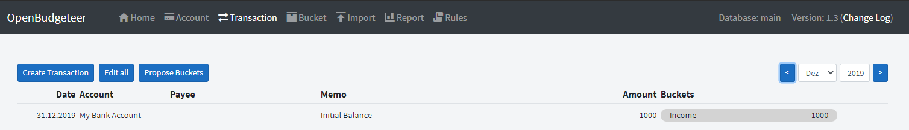
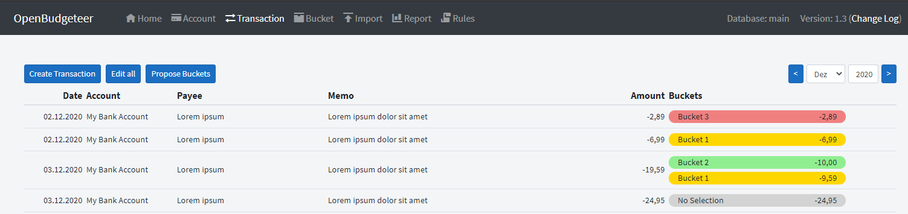
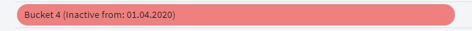

<p align="center">
    
</p>

<p align="center">
    <a href="https://github.com/TheAxelander/OpenBudgeteer/actions/workflows/docker-image-pre-release.yml">
        
    </a>
    <a href="https://github.com/TheAxelander/OpenBudgeteer/actions/workflows/docker-image-master.yml">
        
    </a>
</p>
<p align="center">
    <a href="https://github.com/awesome-selfhosted/awesome-selfhosted#money-budgeting--management">
        
    </a>
    
    
</p>

OpenBudgeteer is a budgeting app based on the Bucket Budgeting Principle and inspired by [YNAB](https://www.youneedabudget.com) and [Buckets](https://www.budgetwithbuckets.com). The Core is based on .NET and the MVVM Pattern, the Front End uses Blazor Server.



--------------------

## Table of contents

- [Installation (Docker)](#installation-docker)
  - [Pre-release Version (Docker)](#pre-release-version-docker) 
  - [Docker-Compose](#docker-compose)
- [Build on Linux and Deploy on nginx](#build-on-linux-and-deploy-on-nginx)
- [Additional Settings](#additional-settings)
- [How to use](#how-to-use)
  - [Create Bank Account](#create-bank-account)
  - [Import Transactions](#import-transactions)
  - [Create Buckets](#create-buckets)
  - [Bucket Assignment](#bucket-assignment)
  - [Bucket History](#bucket-history)

## Installation (Docker)

You can use the pre-built Docker Image from [Docker Hub](https://hub.docker.com/r/axelander/openbudgeteer). It requires a connection to a database which can be achieved by passing below variables.
Currently, the following database servers are supported:

| CONNECTION_PROVIDER | Database system                                      |
|---------------------|------------------------------------------------------|
| TEMPDB              | SQLite in a temp file                                |
| SQLITE              | SQLite. Use CONNECTION_DATABASE to specify file name |
| MYSQL               | Oracle MySQL®                                        |
| MARIADB             | MariaDB (FOSS MySQL fork)                            |
| POSTGRES            | PostgreSQL                                           |
| POSTGRESQL          | PostgreSQL                                           |

Automated database initialization is only supported in case of MySQL, SQLite and MariaDB. In case of postgres, please consider the container-per database postgres pattern, and let container init take care of the database creation, or create the role and database yourself.
For postgres, the database created by you must be empty, the role must exist, and should have CREATE permission for all objects in the public schema of the target database.

The usage of `CONNECTION_ROOT_PASSWORD` is optional in case User and Database are not existing and should be created by OpenBudgeteer in MariaDB or MySQL®.

| Variable                 | Description                            | Example                 | Default value                          |
|--------------------------|----------------------------------------|-------------------------|----------------------------------------|
| CONNECTION_PROVIDER      | Type of database that should be used   | mysql                   | none, must be supplied                 |
| CONNECTION_SERVER        | IP Address/FQDN of the database Server | 192.168.178.100         | localhost                              |
| CONNECTION_PORT          | Port to database Server                | 3306                    | (default port for the chosen provider) |
| CONNECTION_DATABASE      | Database name                          | MyOpenBudgeteerDb       | postgres for postgres                  |
| CONNECTION_USER          | Database user                          | MyOpenBudgeteerUser     | postgres for postgres                  |
| CONNECTION_PASSWORD      | Database password                      | MyOpenBudgeteerPassword | NULL                                   |
| CONNECTION_ROOT_PASSWORD | Root Password                          | MyRootPassword          | Optional parameter                     |

```bash
docker run -d --name='openbudgeteer' \
    -e 'CONNECTION_PROVIDER'='mysql' \
    -e 'CONNECTION_SERVER'='192.168.178.100' \
    -e 'CONNECTION_PORT'='3306' \
    -e 'CONNECTION_DATABASE'='MyOpenBudgeteerDb' \
    -e 'CONNECTION_USER'='MyOpenBudgeteerUser' \
    -e 'CONNECTION_PASSWORD'='MyOpenBudgeteerPassword' \
    -e 'CONNECTION_MYSQL_ROOT_PASSWORD'='MyRootPassword' \
    -p '6100:80/tcp' \
    'axelander/openbudgeteer:latest'
```

Alternatively you can use a local `Sqlite` database using the below settings:

```bash
docker run -d --name='openbudgeteer' \
    -e 'CONNECTION_PROVIDER'='SQLITE' \
    -e 'CONNECTION_DATABASE'='/srv/openbudgeteer.db' \
    -v '/my/local/path:/srv'  \
    -p '6100:80/tcp' \
    'axelander/openbudgeteer:latest'
```
If you don't change the Port Mapping you can access the App with Port `80`. Otherwise like above example it can be accessed with Port `6100`

### Pre-release Version (Docker)

A Pre-Release version can be used with the Tag `pre-release`

```bash
docker run -d --name='openbudgeteer' \
    -e 'CONNECTION_PROVIDER'='mysql' \
    -e 'CONNECTION_SERVER'='192.168.178.100' \
    -e 'CONNECTION_PORT'='3306' \
    -e 'CONNECTION_DATABASE'='MyOpenBudgeteerDb' \
    -e 'CONNECTION_USER'='MyOpenBudgeteerUser' \
    -e 'CONNECTION_PASSWORD'='MyOpenBudgeteerPassword' \
    -e 'CONNECTION_MYSQL_ROOT_PASSWORD'='MyRootPassword' \
    -p '6100:80/tcp' \
    'axelander/openbudgeteer:pre-release'
```

### Docker-Compose

Below an example how to deploy OpenBudgeteer together with PostgreSQL Server. 
Please note that role and database `openbudgeteer` will be created with full authority on the `db` container on the first initialization of the database.

```yml
version: "3"

networks:
  app-global:
    external: true
  db-internal:


services:
  openbudgeteer:
    image: axelander/openbudgeteer
    container_name: openbudgeteer
    ports:
      - 8081:80
    environment:
      - CONNECTION_PROVIDER=postgres
      - CONNECTION_SERVER=openbudgeteer-db
      - CONNECTION_DATABASE=openbudgeteer
      - CONNECTION_USER=openbudgeteer
      - CONNECTION_PASSWORD=My$uP3rS3creTanDstr0ngP4ssw0rD!!!
      - APPSETTINGS_CULTURE=en-US
      - APPSETTINGS_THEME=solar
    depends_on:
      - db
    networks:
      - app-global
      - db-internal

  db:
    image: postgres:alpine
    container_name: openbudgeteer-db
    environment:
      - POSTGRES_USER=openbudgeteer
      - POSTGRES_PASSWORD=My$uP3rS3creTanDstr0ngP4ssw0rD!!!
      - POSTGRES_DB=openbudgeteer
    volumes:
      - data:/var/lib/postgresql/data
    networks:
      - db-internal

volumes:
  data:
```

## Build on Linux and Deploy on nginx

Install .NET SDK 6 for your respective Linux distribution. See [here](https://docs.microsoft.com/en-us/dotnet/core/install/linux) for more details. Below example is for Debian 11

```bash
wget https://packages.microsoft.com/config/debian/11/packages-microsoft-prod.deb -O packages-microsoft-prod.deb
sudo dpkg -i packages-microsoft-prod.deb
rm packages-microsoft-prod.deb

sudo apt-get update; \
  sudo apt-get install -y apt-transport-https && \
  sudo apt-get update && \
  sudo apt-get install -y dotnet-sdk-6.0 
```

Install nginx

```bash
sudo apt install nginx

sudo systemctl start nginx 
```

Clone git Repository and Build project

```bash
git clone https://github.com/TheAxelander/OpenBudgeteer.git
cd OpenBudgeteer/OpenBudgeteer.Blazor

dotnet publish -c Release --self-contained -r linux-x64
```

Modify `appsettings.json` and enter credentials for a running database server, or use sqlite

```bash
cd bin/Release/net6.0/linux-x64/publish

nano appsettings.json
```

For MySQL:

```json
{
  "CONNECTION_PROVIDER": "mysql",
  "CONNECTION_DATABASE": "openbudgeteer",
  "CONNECTION_SERVER": "192.168.178.100",
  "CONNECTION_PORT": "3306",
  "CONNECTION_USER": "openbudgeteer",
  "CONNECTION_PASSWORD": "openbudgeteer",
  "CONNECTION_ROOT_PASSWORD": "myRootPassword",
  "Logging": {
    "LogLevel": {
      "Default": "Information",
      "Microsoft": "Warning",
      "Microsoft.Hosting.Lifetime": "Information"
    }
  },
  "AllowedHosts": "*"
}
```

For Postgres (please note that the target database must exist. If not sure, just create a docker container, and point the app to it.):

```json
{
  "CONNECTION_PROVIDER": "postgresql",
  "CONNECTION_DATABASE": "openbudgeteer",
  "CONNECTION_SERVER": "192.168.178.100",
  "CONNECTION_USER": "openbudgeteer",
  "CONNECTION_PASSWORD": "openbudgeteer",
  "Logging": {
    "LogLevel": {
      "Default": "Information",
      "Microsoft": "Warning",
      "Microsoft.Hosting.Lifetime": "Information"
    }
  },
  "AllowedHosts": "*"
}
```

For Sqlite:

```json
{
  "CONNECTION_PROVIDER": "sqlite", 
  "Logging": {
    "LogLevel": {
      "Default": "Information",
      "Microsoft": "Warning",
      "Microsoft.Hosting.Lifetime": "Information"
    }
  },
  "AllowedHosts": "*"
}
```

Start server running on port 5000

```bash
./OpenBudgeteer --urls http://0.0.0.0:5000
```

## Themes

OpenBudgeteer is compatible with [Bootswatch Themes](https://bootswatch.com)

## Additional Settings

| Variable            | Description                                                                                                | Default                 |
|---------------------|------------------------------------------------------------------------------------------------------------|-------------------------|
| APPSETTINGS_CULTURE | Localization identifier to set things like Currency, Date and Number Format. Must be a BCP 47 language tag | en-US                   |
| APPSETTINGS_THEME   | Sets the [Bootswatch](https://bootswatch.com) Theme that will be used.                                     | default                 |


## How to use

### Create Bank Account

The best way to start with OpenBudgeteer is to create at least on Bank Account on the `Account Page`.



### Import Transactions

After that export some Transactions from your Online Banking and import the data using `Import Page`. At the moment it support CSV files only but you can individually set the characters for delimiter and text qualifier. The respective settings and other options are shown once the CSV file has been uploaded.



You also need to create an initial Transaction which includes the Bank Balance on a certain date. It should be the previous day of the very first imported Transaction. You can do this on the `Transaction Page`.

Example:

You have imported all Transactions starting 2020-01-01. To have the right Balances create a Transaction for 2019-12-31 and add as amount the Account Balance of this day. You can mark this Transaction as `Income` (see more explanation in section `Bucket Assignment`).



### Create Buckets

Once you have some Transactions imported you can start creating Buckets on the `Bucket Page`. If you don't know what kind of Buckets you need, maybe start with some Buckets for your monthly or even yearly expenses like Car Insurance, Property Taxes, Instalments etc. and Buckets for your regular needs like Groceries or Gas. You can also create a Bucket for your next big trip by putting some money into it every month.

If you are happy with your setup, put some money into your Buckets. You can do it manually or automatically if a Bucket has a Want for the current month.

### Bucket Assignment

In the final step you assign your Transactions to certain Buckets. Go back to the `Transaction Page`, edit a Transaction and select an appropriate Bucket. You can also do a mass edit. If a Transaction belongs to more than one Bucket just reduce the assigned amount and you get automatically the option to assign the remaining amount to another Bucket.



Transactions which represent your (monthly) income can be assigned to the pre-defined `Income` Bucket. If you have transferred money from one Account to another you can use the `Transfer` Bucket. Please ensure that all `Transfer` Transaction have in total a 0 Balance to prevent data inconsistency and wrong calculations.

Once all Transactions are assigned properly you can go back to the Bucket Overview to see if your Budget management is still fine or if you need to do some movements. You should always ensure that your Buckets don't have a negative Balance. Also your `Remaining Budget` should never be negative.

### Bucket History

OpenBudgeteer has a built-in versioning for Buckets which enables a proper history view on previous months. If you modify a Bucket, like changing the Type or the Target Amount, it will create a new version for the current selected month. It is not recommended to change a Bucket in the past, a change between two Bucket Version is prevented.

If you close a Bucket it will be marked as `Inactive` for the next month. This can be only done if the Bucket Balance is 0 to prevent wrong calculations.


